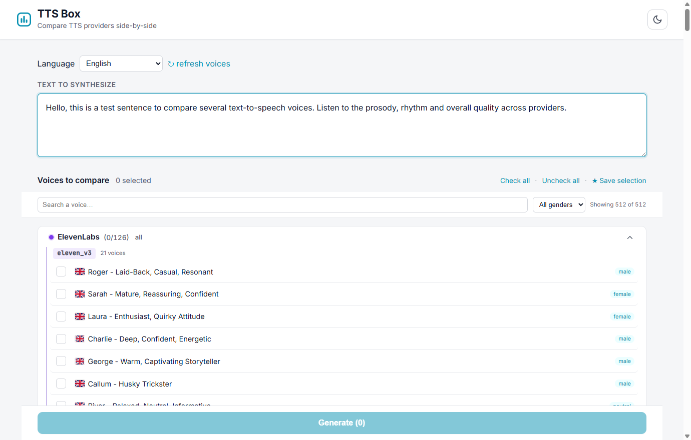
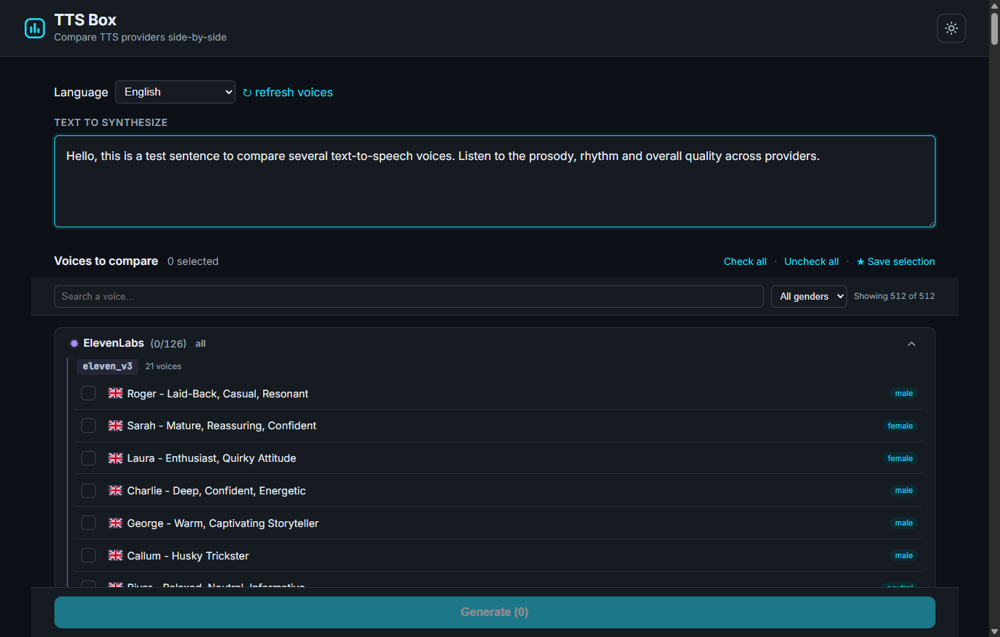

# 🎙️ TTS Box

> Compare text-to-speech voices from every major provider — side by side, on the same text.

[](https://github.com/AcudoDev/tts-box/actions/workflows/ci.yml)
[](LICENSE)

[](https://github.com/astral-sh/ruff)


Pick a language, browse **every voice** your configured providers expose, tick a few, type some text, and hear them render side by side. Light & dark, mobile-first, zero build step.

<p align="center">
  
  
</p>

**Providers:** ElevenLabs · OpenAI · Azure Speech · Cartesia · Murf · OpenRouter (Gemini, gpt-4o-mini, Voxtral, Kokoro, and more) — hundreds of voices in one place.

---

## ✨ Features

- 🔍 **Live voice discovery** — every voice is fetched from each provider's API at runtime (cached 1 h), never hard-coded. Add a voice to your account and it just appears. Hit **↻ refresh voices** to re-fetch.
- 🌍 **Language-aware** — choose a target language and the catalog narrows to it: voices native to that language show their **flag**, while multilingual generalists (OpenAI, Gemini…) show a 🌐 and stay available for any language.
- ⚡ **Streaming comparison** — results stream in as each provider responds; play and download each clip (`↓ DL`).
- 💸 **Cost estimate** per clip, so you compare price as well as quality.
- 🎨 **Light & dark themes** — follows your OS, with a manual toggle, built on a tokenized design system.
- 📱 **Mobile-first & responsive** — designed for a phone first; sticky filter bar and a sticky **Generate** button always within thumb's reach.
- ♿ **Accessible** — keyboard navigation, screen-reader live regions, visible focus rings, `prefers-reduced-motion`.
- 🧩 **One-file providers** — add a TTS provider in a single Python file; it's auto-discovered.
- 🔒 **Local & private** — no accounts, no database, audio is ephemeral, your API keys never leave your `.env`.
- 🛠️ **Zero build step** — FastAPI + HTMX + vanilla CSS. No bundler, no `npm`, no framework.

## 🚀 Quick start

**Prerequisite:** [**uv**](https://docs.astral.sh/uv/getting-started/installation/) — it installs and manages Python 3.12+ for you.

```bash
git clone https://github.com/AcudoDev/tts-box.git
cd tts-box
cp .env.example .env          # add at least one provider key (see below)
uv sync                       # creates the venv + installs everything
uv run uvicorn app.main:app
```

Open **<http://127.0.0.1:8000>**. A missing key simply hides that provider — no error — so you only need **one** key to start.

## 🔑 API keys

Put the keys for the providers you want in `.env` (copy from `.env.example`):

| Provider | Env var(s) | Get a key |
|----------|-----------|-----------|
| ElevenLabs | `ELEVENLABS_API_KEY` | <https://elevenlabs.io> |
| OpenAI | `OPENAI_API_KEY` | <https://platform.openai.com> |
| Azure Speech | `AZURE_SPEECH_KEY` + `AZURE_SPEECH_REGION` | <https://portal.azure.com> |
| Cartesia | `CARTESIA_API_KEY` | <https://cartesia.ai> |
| Murf | `MURF_API_KEY` | <https://murf.ai> |
| OpenRouter | `OPENROUTER_API_KEY` | <https://openrouter.ai> |

## 🎙️ Usage

1. **Pick a language.** The catalog narrows to voices that speak it.
2. **Search / filter** by name or gender, expand a provider, and tick the voices to compare. **★ Save selection** remembers your picks in the browser.
3. **Type your text** and click **Generate** (or press `Ctrl+Enter`).
4. **Listen.** Cards stream in as each provider responds — play, compare latency & cost, and **↓ DL** to download.

> Audio is **ephemeral**: a new generation replaces the previous one, and stopping the server clears everything.

## 🧩 Add a provider

1. Create `app/providers/<name>.py` with a class extending `TTSProvider` (use `app/providers/elevenlabs.py` as a template). Implement `list_models`, `list_voices`, and `synthesize`. Give each voice a `language` (ISO 639-1) when it's tied to one, or leave it `None` for a language-agnostic voice.
2. Add its API-key env var to `.env.example`.
3. Restart the server — the provider is auto-discovered. No other wiring needed.

## 🧪 Development

```bash
uv run pytest          # unit tests (HTTP mocked via respx — no network, no keys needed)
uv run ruff check .    # lint
```

CI runs both on every push and pull request (`.github/workflows/ci.yml`).

## 🛠️ How it works

- **Pull, not push.** A small catalog layer (`app/voice_catalog.py`) calls each provider's `list_voices()` in parallel, caches the result (1 h TTL), and filters it by the selected language. There's no hand-maintained list of voices.
- **One rule for language.** A voice with a declared language appears only under that language and shows its flag; a voice with no language is a generalist shown under every language with a 🌐.
- **Server-rendered, no SPA.** Routes return HTML fragments swapped in by HTMX; theming and small interactions are native CSS custom properties + a few lines of vanilla JS.

## 📦 Tech stack

[FastAPI](https://fastapi.tiangolo.com/) · [HTMX](https://htmx.org/) · [Jinja2](https://jinja.palletsprojects.com/) · [httpx](https://www.python-httpx.org/) · [pytest](https://docs.pytest.org/) + [respx](https://lundberg.github.io/respx/) · [Ruff](https://docs.astral.sh/ruff/) · [uv](https://docs.astral.sh/uv/). No JavaScript build step.

## 🙏 Credits

Country flags by [flag-icons](https://github.com/lipis/flag-icons) (MIT). Fonts: [Inter](https://rsms.me/inter/) & [JetBrains Mono](https://www.jetbrains.com/lp/mono/).

## 📄 License

[MIT](LICENSE) © AcudoDev
